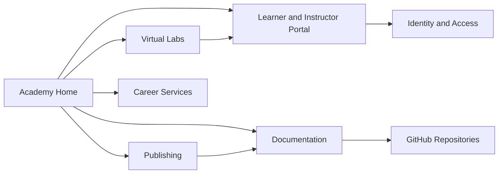

# Platform architecture

Skunkworks Academy is organised as a set of independently deployable web modules under the `skunkworksacademy.com` domain. Each module owns a bounded responsibility while sharing navigation, identity conventions, visual language, observability standards, and governance controls.

## Module model

## Architectural requirements

- Use canonical HTTPS URLs and explicit module ownership.
- Keep shared top-level navigation consistent across domains.
- Prefer static generation for public documentation and marketing surfaces.
- Isolate authenticated learner, instructor, and administrative capabilities behind the appropriate identity boundary.
- Apply least privilege, multifactor authentication, secure secret storage, audit logging, and dependency scanning.
- Publish machine-readable metadata, accessible semantic markup, and responsive layouts.

## Documentation deployment

This module uses Docusaurus to generate static assets. GitHub Actions validates pull requests and deploys the `build/` output to GitHub Pages after changes reach `main`. The custom domain is declared through `static/CNAME`.
