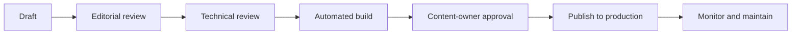

# Publishing workflow

The documentation lifecycle separates drafting, review, release, and maintenance so that published guidance remains accurate and traceable.

## Lifecycle

## Pull-request requirements

Every substantive change should state:

- the problem or documentation gap;
- the intended audience;
- the affected Academy module or operational process;
- screenshots or build evidence for layout changes;
- security, privacy, accessibility, and backward-compatibility considerations;
- the review owner and maintenance responsibility.

## Release controls

The CI workflow must reject broken internal links or failed Docusaurus builds. Production deployment occurs only from `main` through the GitHub Pages deployment environment. Rollback is performed by reverting the responsible commit and allowing the deployment workflow to republish the last approved state.
